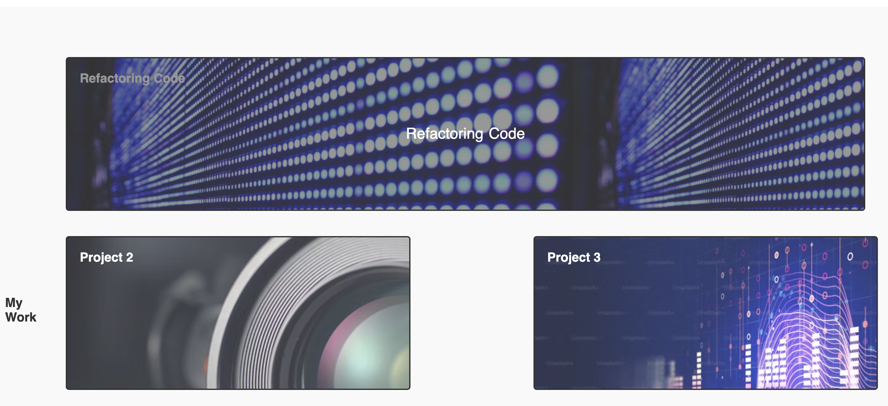

# Module 2 Challenge

## Description

My motivation for creating this site was to make a portfolio to showcase my software development work to employers. I built this project to create a portfolio to showcase my best work to future employers. The site solves the problem of not having a dedicated site to showcase my developer projects. I learned how to create images with links and advanced CSS.

## Deployed Site

https://stefanfilm.github.io/Module2Challenge/

## Installation

To install my project, please visit https://github.com/stefanfilm/Module2Challenge 

Clone the repository to your local. 

Open the repository in a code editor. 

Access the HTML and CSS files to get the development environment running. 

## Usage

The site functions as a portfolio website. You could add a link to the portfolio project and upload a featured image.

    
    
## Credits

I worked on this project with guidance from the UC Berkeley Full Stack Bootcamp curriculum under the instruction of Mark Carlson.

## License

MIT License

Copyright (c) 2024 Stefan Wanigatunga

Permission is hereby granted, free of charge, to any person obtaining a copy
of this software and associated documentation files (the "Software"), to deal
in the Software without restriction, including without limitation the rights
to use, copy, modify, merge, publish, distribute, sublicense, and/or sell
copies of the Software, and to permit persons to whom the Software is
furnished to do so, subject to the following conditions:

The above copyright notice and this permission notice shall be included in all
copies or substantial portions of the Software.

THE SOFTWARE IS PROVIDED "AS IS", WITHOUT WARRANTY OF ANY KIND, EXPRESS OR
IMPLIED, INCLUDING BUT NOT LIMITED TO THE WARRANTIES OF MERCHANTABILITY,
FITNESS FOR A PARTICULAR PURPOSE AND NONINFRINGEMENT. IN NO EVENT SHALL THE
AUTHORS OR COPYRIGHT HOLDERS BE LIABLE FOR ANY CLAIM, DAMAGES OR OTHER
LIABILITY, WHETHER IN AN ACTION OF CONTRACT, TORT OR OTHERWISE, ARISING FROM,
OUT OF OR IN CONNECTION WITH THE SOFTWARE OR THE USE OR OTHER DEALINGS IN THE
SOFTWARE.

## Badges

---

